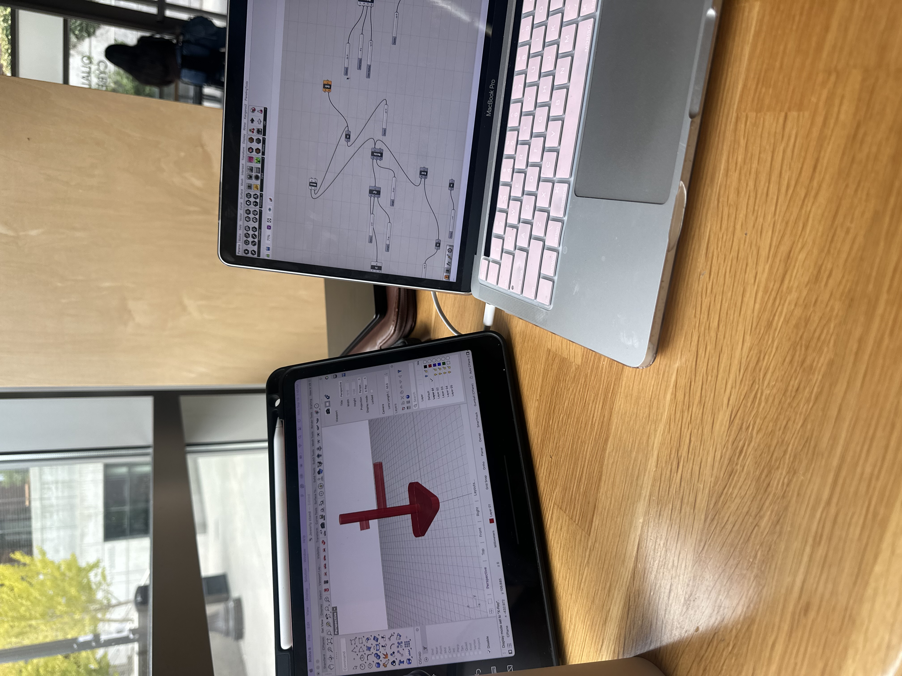

# Hello DES INV 202 Student!
Welcome to your new GitHub repository! 

# Outline
[Week 1](README.md#week-1)

[Week 2](README.md#week-2)

[Week 3](README.md#week-3)

[Week 4](README.md#week-4)

[Week 5](README.md#week-5)

[Week 6](README.md#week-6)

---

# Github Background Information & Context
If you’re new to GitHub, you can think of this as a shared file space (like a Google Drive folder, or a like a USB drive that’s hosted online.) 

This is your space to store project files, videos, PDFs, notes, images, etc., and (hopefully, neatly) organize so it's easy for viewers (and you!) to navigate. That said, it’s super easy for you to share any file or folder with us (your TDF instructional team) - just send us the link!  As a start, feel free to simply add images to the `/assets` folder, which is located [here](/assets). 

The specific file that I’m typing into right now is the **README.md** for this repo. 
##### (💡 TIP: The .md indicates that we’re using [Markdown formatting.](https://www.markdownguide.org/cheat-sheet/)) #####
<h6> (💡 TIP 2: GitHub Markdown supports <a href="https://gist.github.com/seanh/13a93686bf4c2cb16e658b3cf96807f2"> <em>HTML formatting</em> too, including emojis 😄</a>, in case that helps!) </h6>

### :star: Whatever you write in your **README.md** will show up on the “front page” of your GitHub repo. This is where we’ll be looking for your [weekly progress reports](https://github.com/Berkeley-MDes/24f-desinv-202/wiki/3.0-Weekly-Submissions#weekly-progress-report). They might look something like this: ###

# Week 6 #

Progress Report: Soldering, Forming a Team for Project 2 and building a proposal for our project.

**Soldering and Initial Experiments**

This week, I successfully soldered the Stemma QT interface board, my first experience with soldering, which I found rewarding with guidance from Gary in the makerspace. I also downloaded the project files and configured them in Visual Studio Code for our experiments. For the homework assignment, I explored two Stemma-based sensor projects, documenting my findings and experimenting with how to map sensor values within the firmware code. This included using the map() function for LED outputs and employing constrain() to manage any noisy sensor readings.

--- 

**Group Formation and Project Proposal**

In class, we formed groups for our project, "Magic Spell." I was particularly intrigued by Jiaqi's pitch, which involved using motion data to cast spells—an idea that resonates with my previous experiences at Disney. Our team includes myself, Jiaqi Wang, and Isabella Wang. We aim to utilize Particle Photon 2 devices, Particle Cloud Services, and STEMMA QT-based sensors to develop an interactive system that recognizes motion data and triggers corresponding animations in p5.js.

--- 

**Project Overview
Introduction:**
The goal of our project is to develop a system that uses motion data from waving a wand to recognize spells through machine learning and trigger animations displayed on a screen. If time permits, we hope to integrate physical outputs using motors and LEDs.

**Objectives:**

- Validate the feasibility of using Particle Photon 2 devices in various applications.

- Create interactive experiences through motion data and sensor integration.

**Team Member Roles:**

**Jiaqi Wang:** Level 03-Axolotl, focusing on ML motion recognition.
 
**Isabella Wang:** Level 03-Axolotl, responsible for rigging the Photon and the sensors.

**Precious Aghaeze:** Level 03-Axolotl, exploring animations in p5.js.

---

# Week 5 #

**Progress Report: Circuit Board Setup, Wiring, and Compiling C++ Programs**

This week, I made significant progress by setting up my circuit board, learning how to wire it correctly (acording to the picture, and successfully connecting it to the Berkeley IoT network. This was my first hands-on experience with hardware integration, and it gave me a deeper understanding of how software interacts with physical components.

**Circuit Board and IoT Network:**

**Wiring and Connection:** I learned how to properly wire my circuit board to make sure all components were securely connected. This process helped me understand the importance of accuracy and troubleshooting in hardware setup. 

 

**Connecting to Berkeley IoT Network:** Once the board was wired, I connected it to the Berkeley IoT network, which allowed me to start testing my code in real-time. This step was essential in learning how IoT devices communicate and how my code impacts the physical behavior of the device.

**Files Compiled:**

**01_helloworld.cpp:** A basic Hello World program that helped me reinforce the syntax of C++ and its structure.
**02_helloworld_spell.cpp:** A modified version of Hello World that introduced the concept of spell-checking in the output.
**03_altering_periodicity.cpp:** A more complex file where I explored altering periodic behavior in loops, testing my understanding of timing functions and how they impact program execution. 

**Key Learnings:**

**Understanding the Compilation Process:** This was my first time working through the entire process of compiling a C++ file and then flashing it onto a device. I learned about the steps required in the compilation process, including error handling and debugging.

**Hands-On Application of C++ Concepts:** I reinforced my knowledge of C++ syntax and key concepts such as loops, functions, and conditional statements, which were essential for ensuring the successful execution of my programs.

**Flashing Experience:** Flashing the compiled programs onto a device provided me with an understanding of how software interacts with hardware, which was an entirely new experience for me.

**Next Steps:**

Moving forward, I plan to dive deeper into optimizing the performance of my code and improving my debugging skills to handle more complex C++ programs. I also want to explore new tutorials that could enhance the functionality of future projects.

---
# Later in the week I worked on the 3 tutorials # 

**Tutorial 1: Button to LED Pulse Rate:**

In this tutorial, I wrote and compiled code that changed the blinking period of an LED when a button was pressed. The goal was to control the pulse rate of the LED through button interactions.

**Problem Faced:** Initially, the LED did not blink, and I quickly realized that the issue was with how I had connected the longer lead of the LED. The cathode (longer lead) was incorrectly positioned, which disrupted the circuit. After troubleshooting and correctly connecting it, the LED blinked as expected. This taught me the importance of precise wiring, especially when working with hardware components.

---

# Week 4 #

# Personal Device Ecosystem Analysis with AirPods Pro #

# Overview # 

This week, I focused on analyzing and mapping my personal device ecosystem, centering on the role of AirPods Pro within my daily interactions with various platforms and devices. The purpose was to visually represent the connections, information flow, and feedback loops that I engage with on a daily basis.

---

I chose to create a concept map to clearly visualize the interconnected systems, breaking the map into three primary areas: **Connections, Information Flow, and Feedback Loops.** The focus was on how data and interactions pass between the AirPods Pro and other devices such as my iPhone, MacBook, and Apple Watch.

**Concept Map Breakdown**

The concept map is organized into three major components:

**1. Connections**

AirPods Pro connects to multiple devices via Bluetooth. These include:
* **iPhone:** Handles calls, messages, and media playback.
* **MacBook:** Streams audio for work and entertainment.
* **Apple Watch:** Manages playback, notifications, and quick controls.
* **Streaming Platforms:** Indirect connection to Spotify and Apple Music.
  
**2. Information Flow**

* **Audio Data:** Music, podcasts, and phone calls stream from connected devices to AirPods Pro.
* **Siri Commands:** Voice commands sent from the AirPods Pro to the iPhone for task execution.
* **Sensor Data:** Ear placement is detected which allows the AirPods pro to adjust audio playback accordingly.
* **Message and Call Notifications:** Announcements for incoming messages and calls are made through AirPods Pro.
  
**3. Feedback Loops**

* **Noise Cancellation:** Adjusts to the user’s environment based on external noise levels.
* **Volume Control:** Immediate changes are reflected based on user interaction with the AirPods Pro stems.
* **Battery Notifications:** Alerts sent to connected devices when battery levels are low.
* **Call/Message Announcements:** Feedback provided when receiving messages or calls whcih allows user response through Siri or direct action.

--- 

**Concept Map Image**

---

**Why I Used a Concept Map**

I chose to use a concept map because it's a simple yet effective way to break down the complex features of the AirPods Pro, something I use every day. The AirPods Pro have so many interactions—whether it’s adjusting noise cancellation, switching between devices, or using Siri. A concept map helps me organize all these functions in a way that’s easy to follow.

By categorizing everything into sub-nodes, I can see how different features, like spatial audio or battery notifications, connect with each other. It also helps me visualize how real-time feedback (like announcing calls or adjusting the volume) works across multiple devices. For someone like me, who relies on AirPods Pro daily, it just makes sense to use a structure that simplifies all the moving parts.

---

**Conclusion**

This exercise gave me a clearer understanding of the interconnected nature of my personal device ecosystem, particularly how AirPods Pro serves as a hub for managing audio, commands, and notifications. Using the concept map as a tool, I was able to highlight the connections, smooth flow of information and real-time feedback loops that enhance my user experience.

---

# Week 3 #

# Project 1: Computational Design Progress Report

## Jewelry Stand Design with Grasshopper

### 1. Project Overview
This week, I started working on my computational design project for **Project 1**, where I designed a **jewelry stand** using **Grasshopper & Rhino**. I challenged myself by choosing the **Axolotl** level, which pushed me to explore complex geometries and transformations in Grasshopper.

### 2. Design Process

#### 2.1 Grasshopper File Explanation
In this project, I created a design composed of:
- **A polygon base**: The stand starts with a polygon shape that forms the base.
- **Cylinder and Polygon Structures**: I added a cylinder and another polygon on top. These shapes were moved, rotated, and extruded to create the overall stand structure.
- **Rotation Axis**: One of the key transformations was using the **rotate axis** tool, which allowed me to position parts of the design dynamically.

#### 2.2 Printing and Challenges
When I initially printed the stand, I faced a challenge: the design came out flat and lacked the intended depth. To resolve this, I introduced a **hollow triangle** to support the design and give it the three-dimensional form it needed. This adjustment brought the entire structure to life as I had envisioned.

,  

### 3. Reflections
I am proud of the progress I’ve made so far. This project challenged me to think critically about computational design and the tools I used. Solving the issue with the hollow triangle was a pivotal moment, and it taught me a lot about how small adjustments can completely transform a project.

,  

### 4. Video Demonstration
To see my full design process in action, watch the video below where I demonstrate the steps taken and how I refined the design over time. In the video, I also explain how I resolved key challenges and what I learned along the way.

[Watch the full video of my work](# https://www.youtube.com/watch?v=UsCt0jUYiUI) <!-- (https://www.youtube.com/watch?v=UsCt0jUYiUI) -->

Stay tuned for more updates on this project as I continue refining the design and tackling new challenges!

---

# Week 2 # 

This week, I focused on experimenting with the existing cellphone stand file in Grasshopper, created my own rhino file and created a shape on grasshopper. Here’s a summary of my progress and observations:

---

## Experimenting with the Existing Cellphone Stand Design ## 

**Baking the Existing 3D Model:**
I began by baking the current cellphone stand design to visualize the 3D image.


**Sphere Radius Adjustments:**
I then experimented with the sphere radius, initially set between 40 to 50 units. I extended the radius to 61 units to observe how this affected the overall design.

**Fit Issues with Increased Sphere Size**
When the sphere radius reached 61 units, I noticed that it was too large for the phone fitting, leading to a red warning indicating that the design would not fit the phone properly.
(Insert an image showing the warning or red indicator in Grasshopper here to emphasize the fit issue.)
This observation suggests that there is a set limit for the design to ensure the proper fitting of the phone. I am currently looking for the specific parameter that controls this limit.

**Exploring the Cellphone Stand Cluster**

To find the fitting limit, I navigated to the cellphone stand cluster, which manages key design parameters like the phone width in millimeters. This setting ensures the phone fits correctly in the stand.

By double-clicking on the cluster, I accessed its internal components, where I found detailed controls for adjusting dimensions like the phone width. This allowed me to experiment with different values to achieve a better fit for the phone.




**Experimenting with Shape Changes**
I also experimented with altering the shape of the cellphone stand, attempting to change the design from two spheres to one box. However, I decided to move on from this experiment as the design wasn’t progressing as expected.

## Creating a Trifold Phone Stand in Rhino##
**Objective:**
To design a trifold phone stand using basic tools in Rhino, including creating and positioning solid shapes with precision.

**Creating a Rectangle:**

I started by creating a rectangle in Rhino, which served as the base component for the phone stand.
**Viewing in Shaded Mode:**

To better visualize the design, I switched to Shaded mode in the viewport. This provided a clearer view of the solid shapes as I built the phone stand.

**Using Gumball for Adjustments:**

I utilized the Gumball tool to make precise adjustments to the position and slant of the supporting parts. This allowed me to rotate and move the pieces, giving the stand its distinctive slanted support to hold a phone at a convenient viewing angle.

**Final Phone stand**

Here is the final trifold stand

**Next Steps:**
Refining the fit and making any necessary adjustments to the design for stability. Everthing was just manually designed without further customization.

---

## Creating an Object on Grasshopper ## 

**Objective:** To design a stacked structure consisting of a curved triangle, a circle, and another triangle using Grasshopper.

**Step 1: Creating the Curved Triangle**

To create the design, I started by making a curved triangle using the Polygon component, where I set the radius, segments, and fillet radius to achieve the desired shape. Afterward, I extruded the triangle by connecting the polygon to an Extrude component, setting the direction using a Unit Z vector, and controlling the extrusion depth with a Number Slider. I then connected the radius factor to the Unit Z vector and added a Cap component to close the top and bottom, forming a solid triangle polygon.

**Step 2: Adding the Circle**

Next, I moved on to adding a circle above the triangle. I created a circle and set its radius with a Number Slider, then used a Move component to position it above the first triangle, moving it along the Z-axis with a Unit Z vector. I connected the circle to the Move component and extruded it, again controlling the depth with a Number Slider. To finalize, I applied a Cap component to close the extruded circle.

**Step 3: Repeating for the Top Triangle**

Finally, I repeated the process from the first step to create another triangle. I moved this second triangle above the circle using the Move component, adjusting its position on the Z-axis with a Number Slider to place it properly. The top triangle was also capped to complete the design. This resulted in a stacked structure with a triangle on top of a circle, which was placed on top of another triangle, all fully extruded and capped.

---

# Week 1 #
## Week of 09/05/2024

This week I learnt how to laser cut and Design on Adobe Illustrator

**Project Idea:** I initially designed a wooden flower, which I later decided to convert into a coaster decor by adding squares to the design.

**Key Learnings:**
1. Adobe Illustrator Skills:
   I learned how to design intricate patterns and adjust shapes to fit the laser cutter's capabilities.
2. Laser Cutting Process:
   - Gained experience with using the laser cutter, especially understanding how different line thicknesses affect cutting time.
   - The original design had thick lines, causing the cutting process to take up to 2 hours.
   - By adjusting to thinner lines, I reduced the cutting time significantly to just 12 minutes.

My Work
---

, , 

---

**Challenges:**
    The initial coaster was too large, and I had to make design adjustments for efficiency.
    
**Next Steps:**
Plan to reuse the leftover wood from the coaster project to create a wooden keychain.

**Next week plans**
- Continue learning tutorials on Rhino

---

## Quick Links, compiled here for your convenience: ##

- [TDF Wiki](https://github.com/Berkeley-MDes/24f-desinv-202/wiki) - the ultimate source for truth and information about the course and assignments
- [Google Drive Folder](https://drive.google.com/drive/u/0/folders/1DJ1b6sSDwHXX6NRcQYt10ivyQSgU0ND6) - slides and other resources
- [bCourses](https://bcourses.berkeley.edu/courses/1537533) - where the grading happens
